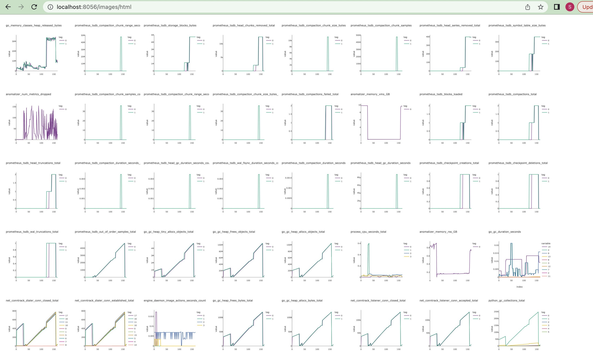
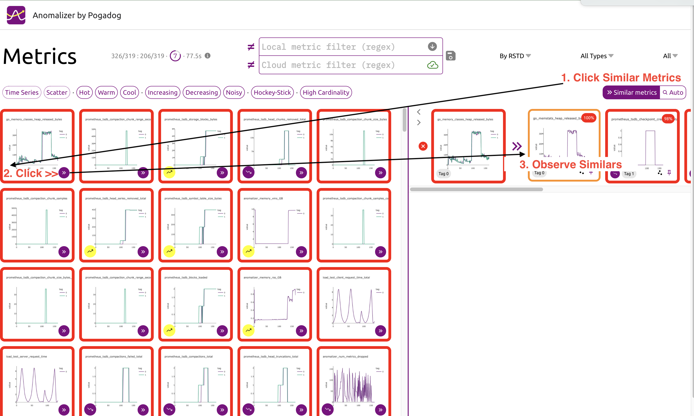
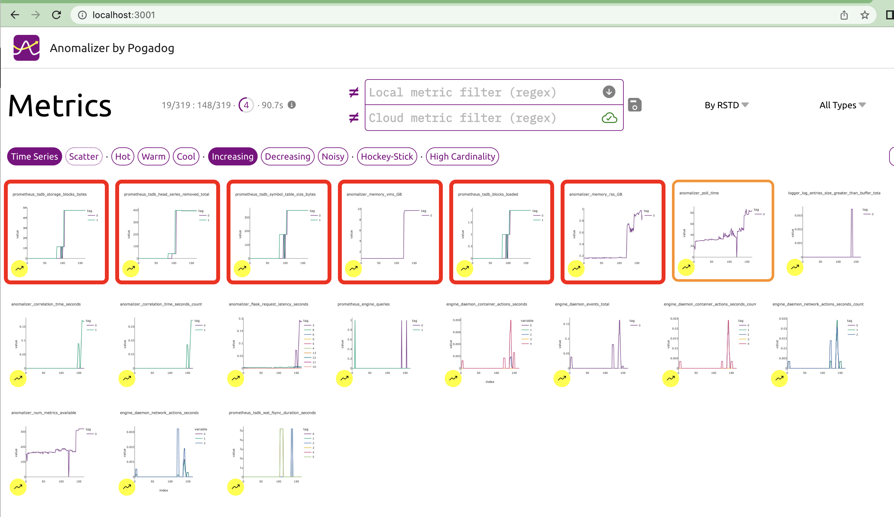
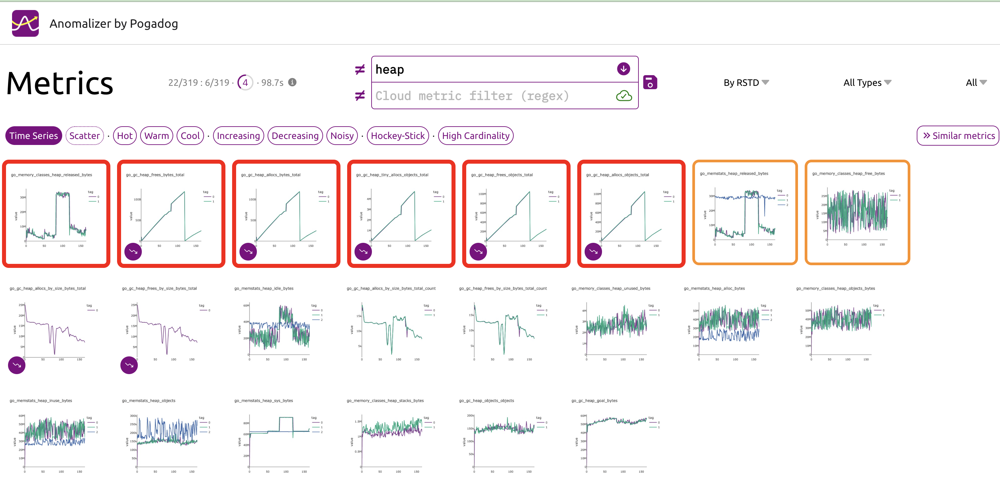
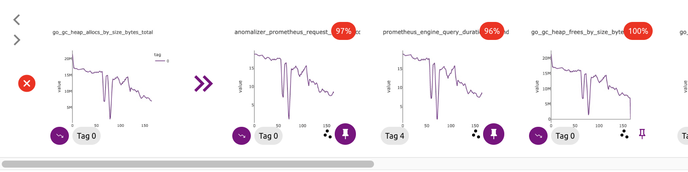
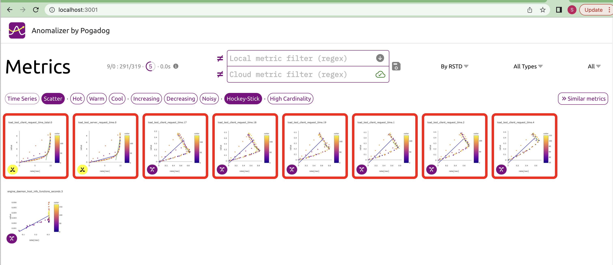

# Anomalizer - Prometheus anomaly visualization [Prototype]

The Anomalizer(TM) is a proof-of-concept visualization tool for Prometheus.
It operates by scraping metrics out of Prometheus, generating images, analyzing them for behavior (increasing, decreasing, noisy) and visualizing them (spark-lines & scattergrams).

## A video is worth 1000x1000 words?


## Quick start
Use `docker-compose` to launch a `mini-prometheus engine`, `anomalizer`, and a
`load-test` to generate data.
```sh
  cd docker
  ./docker-up.sh 
  # launches docker/anomalizer-compose.yaml

```

or without docker-compose, launch a mini-promtheus and a load tester scraped by it:

```sh
docker run -p 8056:8056 -it ghcr.io/pogadog/anomalizer-multi:latest --mini-prom --load-test 
```

To point to a real prometheus on localhost:9090 just omit the --mini-prom argument, and set `-e PROMETHEUS=host.docker.internal:9090`

The Anomalizer UI serves on port `8056`. There are various REST
endpoints, some of which are used by the Anomalizer UI. It connects to Prometheus
on `localhost:9090` by default; this can be overridden in the YAML compose file `docker/anomalizer-compose.yaml` or 
on the command line by setting the `PROMETHEUS` environment variable. 

```yaml
environment:
- PROMETHEUS=host.docker.internal:9090
```
example rest endpoints:

* http://localhost:8056/server-metrics
* http://localhost:8056/images/html
* http://localhost:8056/images

swagger documentation:
* http://localhost:8056/docs

## Building for the AppEngine Cloud

You will need to checkout the anomalizer-ui code as a peer to this folder.
Then you will need to do this to build the web-build distribution that is linked
to a sub-folder under microservices, and also under gcp.  This is needed to allow 
the anomalizer-ui to be served from the main.py (and anomalizer-ui.py file) in this project.

```
expo build:web
```
At this point you should be able to run


```
python anomalizer-service.py
python anomalizer-ui.py
```
and hit the localhost:3001 endpoint to see the live application.  You will need to edit
the config.js file in the anomalizer-ui as follows to make the UI hit a localhost endpoint, 
otherwise it will point to the cloud, and you won't see any changes you make to the 
service here update the behavior (I've done this plenty of times).

```
{
    "port": 3001,
    "_endpoint": "https://anomalizer-demo.uc.r.appspot.com",
    "endpoint": "http://localhost:8056",
    "useArtificialLatency": true
}
```

## Debugging on a desktop machine

Simply load the `anomalizer.py` file into a Python IDE environment, after installing the
`requirements.txt` into a virtual-env (such as pyenv). Make sure to stop the Docker version 
of the Anomalizer before running the stand-alone version.

```
    pyenv install 3.8
    pyenv local 3.8
    pip install -r requirements.txt
    cd python/microservices    
    python anomalizer-service.py
     
Anomalizer(TM) by Pogadog. Copyright (C) 2022. All Rights Reserved.
prometheus is on: http://localhost:9090
FILTER=, LIMIT=1e-09
poller starting...
{'poll-time': 0, 'metric-count': 0, 'metrics-processed': 0, 'metrics-available': 0, 'metrics-dropped': 0, 'metrics-total-ts': 0}
rendering metric: builder_builds_failed_total
rendering metric: builder_builds_triggered_total
rendering metric: engine_daemon_container_actions_seconds
ignoring boring scattergram for engine_daemon_container_actions_seconds: 73c2fe09-9717-4a83-ae69-9b58eeb3a6ab.scatter.0
ignoring boring scattergram for engine_daemon_container_actions_seconds: 73c2fe09-9717-4a83-ae69-9b58eeb3a6ab.scatter.1
ignoring boring scattergram for engine_daemon_container_actions_seconds: 73c2fe09-9717-4a83-ae69-9b58eeb3a6ab.scatter.2
ignoring boring scattergram for engine_daemon_container_actions_seconds: 73c2fe09-9717-4a83-ae69-9b58eeb3a6ab.scatter.3
```

The rendering and "ignoring boring" messages show how the Anomalizer is processing each metric
which is loaded from Prometheus.

### images/html

A simple dump of all the images for the metrics that are in memory can be initiated by querying
the http://localhost:8056/images/html. The following kind of display will be rendered.

This is useful to verify that the Anomalizer engine is processing metrics, but is not 
that usable since it cannot be filtered or sorted; that activity is the job of the 
Anomalizer UI.



## Anomalizer UI

The simplest way to run the Anomalizer UI is with Docker in stand-alone mode. The following
example uses the arm64 build for Anomalizer, so will only work on Apple-silicon mac for now:
a multi-arch build is in the works.

```sh
    docker run -e ENDPOINT=localhost:8056 -p 3001:3001 -it ghcr.io/pogadog/anomalizer-ui-arm64:latest
```

Alternatively you can run the UI by following the instructions here: https://github.com/Pogadog/anomalizer-ui

## Kicking the tires

Here are some of the ways you can manipulate data in the Anomalizer UI:

* Use the "Similar metrics" (1) view to pick a metric (2) and find similars (3).



* Pick increasing and decreasing to see the metrics which are exhibiting trends. Combine
this with "Similar metrics" to find metrics which relate to the trending metrics.



* Use a regex filter to pick only metrics relating to heap-size. Observe that some are decreasing, some have high variance (red-border), some have medium variance (orange border).



* Pick one of the heap metrics and find similars: the similars pane will show metrics other than
"heap" which are related. Interesting metrics can be pinned to the front of the list.



* Checkout scattergrams which are exhibiting hockey-stick behavior (this is a simulated load-test
with a 10 request/second constraint and up to 20 client threads accessing it).




